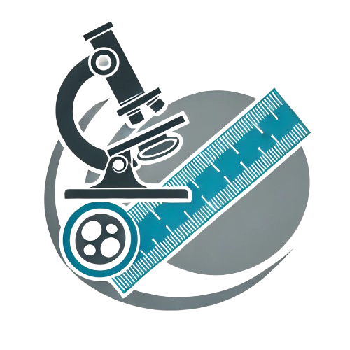
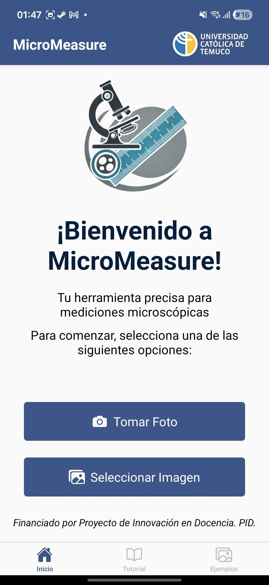
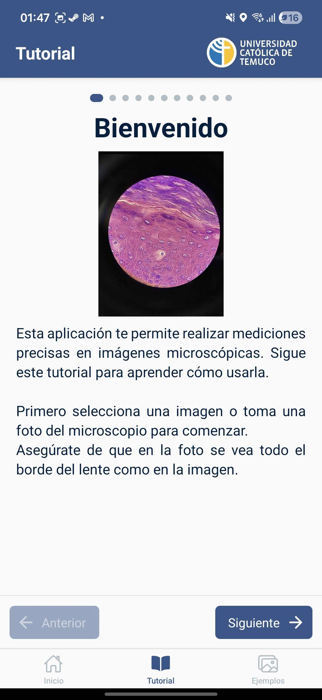
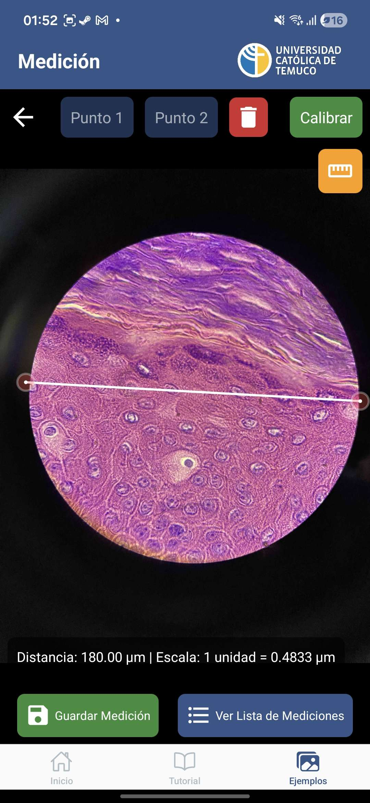
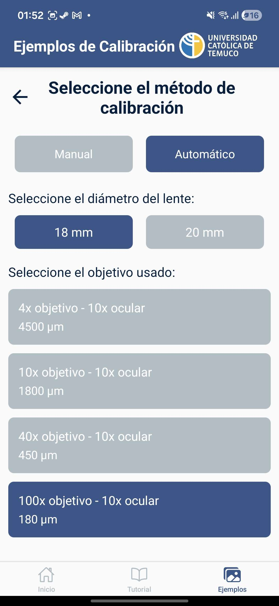
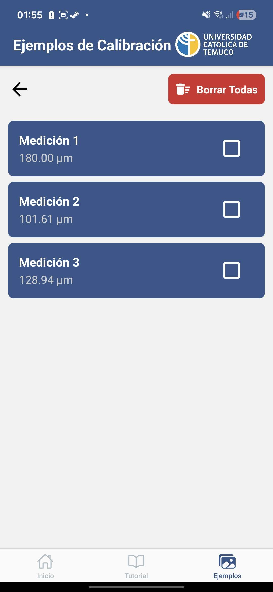

# MicroMeasure

<p align="center">
  
</p>

<p align="center">
  Aplicación móvil para mediciones precisas en imágenes microscópicas
</p>

<p align="center">
  
  
  
  
</p>

---

## 📖 Descripción

MicroMeasure es una aplicación móvil desarrollada con React Native y Expo que permite realizar mediciones precisas sobre imágenes microscópicas. El usuario puede tomar una foto directamente desde la cámara o importar una imagen existente, posicionar puntos de medición con precisión (con soporte de zoom hasta 7x), calibrar la escala según el aumento del microscopio, y guardar un historial de mediciones.

---

## ✨ Características

- 📷 **Captura de imágenes** directamente desde la cámara o galería
- 📏 **Medición por puntos**: coloca dos puntos y obtén la distancia
- 🔍 **Zoom interactivo** (hasta 7x) con gestos de pinch y pan
- ⚖️ **Calibración automática** según el aumento del microscopio (4x, 10x, 40x, 100x con ocular 10x)
- ✏️ **Calibración manual** ingresando una distancia conocida en µm
- 💾 **Historial de mediciones** con timestamps
- 🗑️ **Gestión del historial**: borrado individual, múltiple o total
- 📖 **Tutorial integrado** de 8 pasos con imágenes y carrusel

---

## 🛠️ Tecnologías

| Tecnología | Uso |
|---|---|
| React Native + Expo | Framework principal |
| React Navigation | Navegación (Stack + BottomTabs) |
| expo-camera | Captura de fotos |
| expo-image-picker | Selección de galería |
| react-native-gesture-handler | Gestos de zoom y pan |
| react-native-reanimated | Animaciones (Toast, zoom) |
| react-native-svg | Línea de medición sobre la imagen |
| EAS Build | Compilación y distribución |
| @expo/vector-icons | Iconografía (MaterialIcons, Ionicons) |

---

## 🚀 Instalación

### Prerrequisitos
- Node.js >= 18
- Expo CLI
- EAS CLI >= 14.2.0

```bash
# Clonar el repositorio3v
git clone https://github.com/tu-usuario/micromeasure.git
cd micromeasure

# Instalar dependencias
npm install

# Iniciar en modo desarrollo
npx expo start
```

### Build APK (Preview)
```bash
eas build --profile preview --platform android
```

---

## 📱 Uso

```
Inicio
  ├── Tomar Foto  →  Vista Previa  →  Medición
  └── Seleccionar Imagen           →  Medición
                                        ├── Calibrar
                                        ├── Guardar Medición
                                        └── Ver Lista de Mediciones
Tutorial (tab)
```

1. Desde **Inicio**, tomá una foto o seleccioná una imagen
2. Confirmá la imagen en la **Vista Previa**
3. En **Medición**, tocá la imagen para colocar los 2 puntos
4. Usá zoom (pinch) para mayor precisión
5. **Calibrá** para obtener la distancia en µm
6. **Guardá** la medición si la necesitás conservar

---

## 📸 Capturas de pantalla

<p align="center">
  
  
  
  
  
</p>

<p align="center">
  <sub>Inicio &nbsp;&nbsp;&nbsp;&nbsp; Tutorial &nbsp;&nbsp;&nbsp;&nbsp; Medición &nbsp;&nbsp;&nbsp;&nbsp; Calibración &nbsp;&nbsp;&nbsp;&nbsp; Historial</sub>
</p>

---

## ⚖️ Calibración

### Automática
Dibujá una línea que abarque el diámetro completo del lente y seleccioná el aumento:

| Objetivo | Ocular | Diámetro campo (µm) |
|---|---|---|
| 4x | 10x | 4500 |
| 10x | 10x | 1800 |
| 40x | 10x | 450 |
| 100x | 10x | 180 |

### Manual
Dibujá una línea sobre un elemento de longitud conocida e ingresá la distancia real en µm.

---

## 🗂️ Estructura del proyecto

```
MicroMeasure/
├── assets/                  # Imágenes de la app y tutorial
├── screens/
│   ├── HomeScreen.jsx       # Pantalla principal
│   ├── CameraScreen.jsx     # Captura de fotos
│   ├── ImagePreviewScreen.jsx # Confirmación de imagen
│   ├── MeasurementScreen.jsx  # Medición principal
│   ├── CalibrationScreen.jsx  # Configuración de escala
│   ├── ListScreen.jsx         # Historial de mediciones
│   └── TutorialScreen.jsx     # Tutorial paso a paso
├── styles/
│   └── globalStyles.js      # Colores y estilos globales
├── App.jsx                  # Navegación raíz
├── app.json                 # Configuración Expo
└── eas.json                 # Configuración EAS Build
```

---

## 🎨 Paleta de colores

| Color | Hex | Uso |
|---|---|---|
| Main Blue | `#34568B` | Botones, header, cards |
| Navy | `#001F3F` | Textos principales |
| Soft White | `#FAFAFA` | Fondo general |
| Light Gray | `#B0BEC5` | Bordes, inactivos |

---

## 📄 Licencia

MIT License — © 2026 MicroMeasure